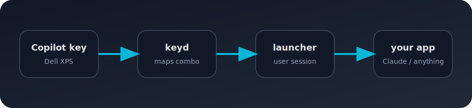

# Copilot Key Oracle

> Français | [English](../README.md) | [Deutsch](./README.de.md) | [Español](./README.es.md) | [Português](./README.pt.md) | [Polski](./README.pl.md)

⚡ Transforme la touche Copilot Dell en lanceur pour n'importe quelle application, URL ou commande sous Linux.

[](https://github.com/fabiangold/copilot-key-oracle/releases)

## Aperçu

```text
Touche Copilot -> keyd -> lanceur utilisateur -> votre app
```



## TL;DR

```bash
git clone https://github.com/fabiangold/copilot-key-oracle.git
cd copilot-key-oracle
chmod +x install.sh
sudo ./install.sh
```

## Communauté

💬 Discord : [fg-dev](https://discord.gg/fg-dev)

## Paquets

- Paquet Debian : télécharge le `.deb` depuis les [Releases](https://github.com/fabiangold/copilot-key-oracle/releases)
- Archive source : télécharge le `.tar.gz` depuis les [Releases](https://github.com/fabiangold/copilot-key-oracle/releases)
- Installation depuis le code source : utilise `install.sh`

> Note : ce repo distribue les paquets via GitHub Releases, pas via l’onglet GitHub Packages.

## Paquets

- Paquet Debian : télécharge le `.deb` depuis les [Releases](https://github.com/fabiangold/copilot-key-oracle/releases)
- Installation depuis le code source : utilise `install.sh`

## Versions linguistiques

- English: `README.md`
- Deutsch: `docs/README.de.md`
- Español: `docs/README.es.md`
- Français: ce fichier
- Português: `docs/README.pt.md`
- Polski: `docs/README.pl.md`
